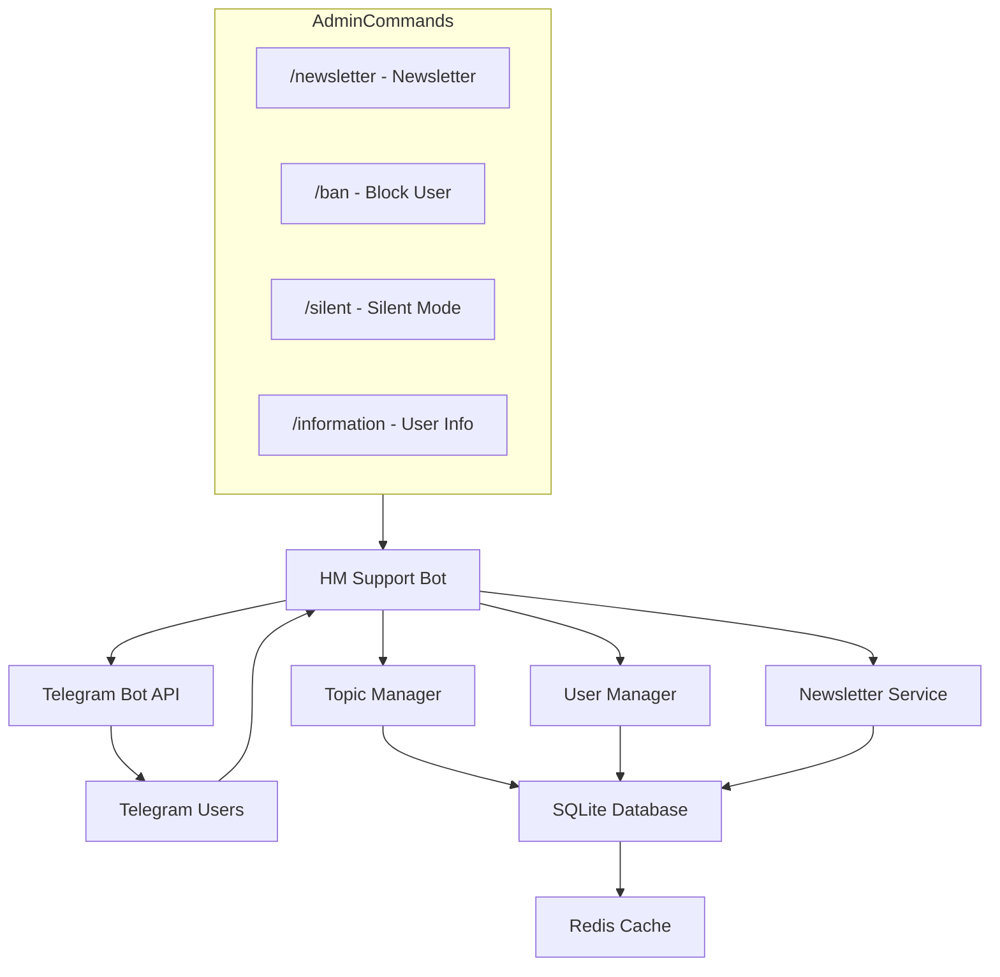

# HM Support Bot

Telegram feedback bot for customer support. Messages from private chats are automatically routed to forum topics in a support group, and staff replies are forwarded back to the user.

## Features

- **Forum topics** — a dedicated topic is created for each user in the support group
- **Two-way messaging** — user messages go to the topic, staff replies go back to the DM
- **Media groups** — album support (photos, videos, audio, documents)
- **Blocking** — `/ban` to block/unblock users
- **Silent mode** — `/silent` disables reply forwarding for a specific user
- **Newsletter** — `/newsletter` for mass messaging via aiogram-newsletter
- **Localization** — English and Russian with per-user language selection
- **Throttling** — spam protection with configurable cooldown

## C4

## Quick Start

1. deps: Linux, Docker, Python 3.11+, Redis
2. env: `cp .env.example .env` and fill in the variables
3. install: `pip install -r requirements.txt`
4. dev: `python -m app`
5. prod: `docker compose up -d`
