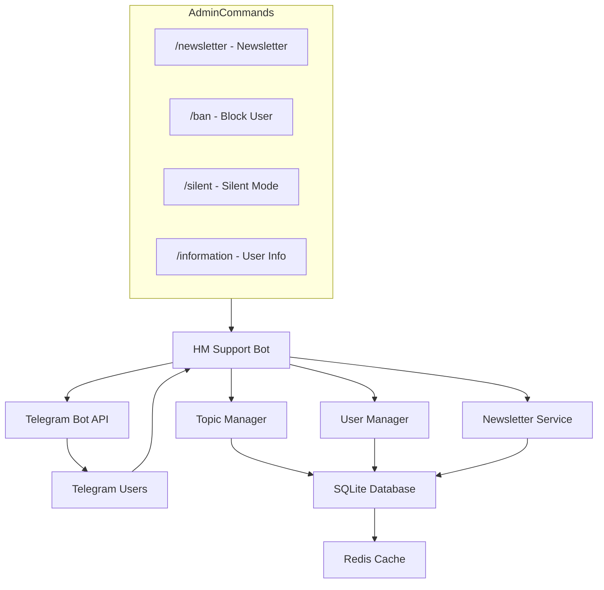

# HM Support Bot


Telegram feedback bot for customer support. Messages from private chats are automatically routed to forum topics in a support group, and staff replies are forwarded back to the user.

## Features

- **Forum topics** — a dedicated topic is created for each user in the support group, on `/start` by default;
  with `BOT_TOPIC_ON_START=false` it waits for the user's first real message, so `/start`-only users and their
  block/unblock notices never reach the group
- **Two-way messaging** — user messages go to the topic, staff replies go back to the DM
- **Media groups** — album support (photos, videos, audio, documents)
- **Blocking** — `/ban` to block/unblock users
- **Silent mode** — `/silent` disables reply forwarding for a specific user
- **Newsletter** — `/newsletter` for mass messaging via aiogram-newsletter
- **Localization** — English and Russian with per-user language selection
- **Throttling** — spam protection with configurable cooldown
- **Policy engine** *(optional)* — declarative YAML rules to auto-reply, tag, close, suppress notifications, or skip topic creation
- **LLM drafts** *(optional)* — classify the first message and suggest a reply to the manager via inline buttons (any OpenAI-compatible provider)
- **Reply reminders** *(optional)* — remind the support group in the user's topic when a reply is overdue

## C4


```mermaid
graph TB
    A[Telegram Users] --> B[HM Support Bot]
    B --> C[Topic Manager]
    B --> D[User Manager]
    B --> E[Newsletter Service]
    C --> F[SQLite Database]
    D --> F
    E --> F
    F --> G[Redis Cache]
    B --> H[Telegram Bot API]
    H --> A

    subgraph AdminCommands
        I["/newsletter - Newsletter"]
        J["/ban - Block User"]
        K["/silent - Silent Mode"]
        L["/information - User Info"]
    end

    AdminCommands --> B
```

## Quick Start

1. deps: Linux, Docker, Python 3.11+, Redis
2. env: `cp .env.example .env` and fill in the variables
3. install: `pip install -r requirements.txt`
4. dev: `python -m app`
5. prod: `docker compose up -d`

### Healthcheck

The bot uses long polling and serves no HTTP, so it signals liveness with a
file: every minute a successful `getMe` writes the current time into
`HEARTBEAT_FILE` (default `/tmp/bot-heartbeat`; empty turns it off).
`docker-compose.prod.yml` marks the container unhealthy once the file is older
than 5 minutes (interval 60s, timeout 10s, 3 retries, 90s start period).

## Policy & AI extensions

Both layers are **off by default** — leaving the env vars at their defaults
keeps the bot behaving exactly as without them.

### Policy engine

Declarative rules in a YAML file decide what happens to incoming messages and
lifecycle events, with no business logic in the code.

```bash
cp config/policy.example.yaml config/policy.yaml   # then edit
# in .env:
POLICY_ENABLED=true
POLICY_CONFIG_PATH=config/policy.yaml
```

Matchers: `event_type` (`user_message` | `user_started` | `user_stopped` |
`topic_created`), `keywords_any`, `regex`, `message_length`, `has_link`,
`first_message` (true only for the user's very first message; one dropped by
`suppress_topic_creation` or not delivered to the topic does not count), combined
with `all` / `any`. Actions: `auto_reply`, `set_tag`, `close_topic`, `escalate`,
`suppress_group_notify`, `suppress_topic_creation`. See
`config/policy.example.yaml` for a documented example.

On upgrade, users who wrote earlier are recognised by their stored transcript or
pending AI draft. One who only ever sent media without a caption and never got a
text reply is taken for new, so their next message counts as the first.

`auto_reply` options (defaults keep the old behaviour):

| Option | Default | Description |
|---|---|---|
| `once` | `defaults.auto_reply_once` (`false`) | Send the template to a user only once; remembered in PostgreSQL per user and template key |
| `suppress_draft` | `true` | Any auto-reply skips the LLM draft; `false` keeps the draft (for "message received" notices) and keeps the notice out of the draft's transcript |

Manager commands in a topic: `/template <key>`, `/tag [name]`, `/close`,
`/escalate`.

The optional `texts` section replaces the bot's built-in texts
(`app/bot/utils/texts.py`) per key and language, for example the `/start`
welcome `main_menu` (may use `{full_name}`). An unknown key or language fails
the policy load; without the section every text stays built in.

```yaml
texts:
  main_menu:
    en: "<b>Hello!</b> Write your question and we will reply as soon as possible."
    ru: "<b>Здравствуйте!</b> Напишите ваш вопрос — ответим в ближайшее время."
```

### LLM drafts

| Env var | Default | Description |
|---|---|---|
| `AI_PROVIDER` | `none` | `none` disables; `openai_compatible` enables |
| `AI_BASE_URL` | `https://openrouter.ai/api/v1` | OpenAI-compatible base URL |
| `AI_API_KEY` | _(empty)_ | API key; empty also disables |
| `AI_MODEL` | `openai/gpt-5.6-luna` | Model id |
| `AI_SYSTEM_PROMPT_PATH` | `config/system_prompt.txt` | System prompt file |
| `AI_TIMEOUT_S` | `8` | Timeout of one request (a single attempt) |
| `AI_MAX_RETRIES` | `2` | Retries after a 429, a 5xx or a timeout; the client waits out `Retry-After` in between |
| `AI_TOTAL_TIMEOUT_S` | `0` | Ceiling on one draft, retries included; `0` derives it as `AI_TIMEOUT_S × (retries + 1) + 120 × retries` |
| `AI_MAX_TOKENS` | `4096` | Cap on the drafted reply length (reasoning tokens included) |
| `AI_REASONING_EFFORT` | _(empty)_ | `minimal`, `low`, `medium` or `high`, sent as OpenRouter's `reasoning.effort` with drafts and classification; empty sends nothing |
| `AI_VISION` | `true` | Send attached images to the model (needs a multimodal `AI_MODEL`) |
| `AI_MAX_IMAGES` | `4` | Images attached per album |
| `AI_IMAGE_MAX_BYTES` | `5242880` | Per-image size ceiling; larger ones are skipped |

When enabled, the first message of a conversation is classified and a draft
reply is posted into the topic with **Send / Skip** buttons. Install the extra
dependency with `pip install -r requirements-ai.txt` (or build the image with
`--build-arg INSTALL_AI=1`).

Only the newest draft of a user can be sent: a new draft removes the buttons of
the previous one, and pressing the buttons of an older draft sends nothing and
answers that it is outdated. If Telegram rejects the send (for example, the user
has blocked the bot), the manager gets an alert and the draft stays pending.

### Draft log, categories and automatic replies

These options live in the `ai` section of the policy file (so they need
`POLICY_ENABLED=true`) and are all off by default.

| Option | Default | Description |
|---|---|---|
| `log_drafts` | `false` | Record every draft and its outcome in PostgreSQL: `sent` (Send button), `skipped` (Skip), `manager_replied` (the manager wrote to the user in the topic while the draft was pending), `superseded` (a newer draft for the same user), `auto_sent` (automatic reply) |
| `categories` | `[]` | Classify the user's first message with a separate short LLM request. Each item: `key` (up to 40 Latin letters, digits, `_` or `-`), `title`, `icon`, `needs_human`, `notify_admins`. The icon goes before the topic name, the category is shown in the draft header and stored in the log, and `notify_admins` messages every admin in `BOT_DEV_IDS` with a link to the topic. An unclear answer maps to `other` when that key exists |
| `auto_threshold` | `0.95` | `/ai_auto` warns before enabling a category whose share of sent drafts is lower |
| `auto_min_drafts` | `20` | ... or which has fewer reviewed drafts than this |

Admin commands in the support group (admins are `BOT_DEV_IDS`):

- `/ai_stats [days]` — per category, over all time or the last 1 to 3650 days:
  total drafts, sent, skipped, manager replied, automatic, and the share of sent
  drafts. The share counts reviewed
  drafts only: sent / (sent + skipped + manager replied).
- `/ai_auto` — every category with its automatic-reply mode and stats.
- `/ai_auto <key> on|off` — asks for confirmation with the category's stats
  (and a warning below the bar); the mode changes only when an admin presses
  **Confirm**. Categories with `needs_human: true` cannot be turned on.

With the mode on, a draft for a conversation of that category goes to the user
right away, as if the manager had pressed Send, and the topic gets a copy marked
as an automatic reply. Silent mode (`/silent`) keeps it a normal draft. Modes are
stored in PostgreSQL and are all off until an admin turns one on.

### Conversation summary

A draft sees the last `max_context_messages` turns of the conversation. With
`summary.enabled` in the `ai` section of the policy file the earlier turns are
not lost: once `fold_batch` of them are outside the window and not summarized
yet, a separate request to the same model folds them into a running summary,
which reaches the draft as a second system message. Fewer than that go to the
model verbatim, between the summary and the window. One request folds at most
the 40 oldest of them, and one draft makes at most 5 requests, saving the
summary after each; a larger backlog is folded by the next drafts, and until
then the draft gets the summary and the window only.

| Option | Default | Description |
|---|---|---|
| `summary.enabled` | `false` | Summarize the turns older than `max_context_messages` |
| `summary.fold_batch` | `8` | Fold once this many older turns are not in the summary |
| `summary.max_chars` | `1200` | Length ceiling of the summary; a longer answer is cut |

The summary keeps what the customer wants, what support has answered, promised
or asked for, the links and data the customer sent, and the open questions, in
the language of the conversation. It is stored per user in PostgreSQL with the
last turn it covers. While the option is on and an AI provider is set, the
stored transcript drops a turn past its 40-turn limit only once the summary has
taken it in; past 200 turns the oldest go anyway, with a warning in the log
saying how many the summary missed. A failed or timed-out summary request (`AI_TOTAL_TIMEOUT_S` applies
to it too) is logged, the draft gets the window alone, and the stored summary
stays as it was.

### Reply reminders

The `reminders` section of the policy file (so it needs `POLICY_ENABLED=true`)
posts a reminder into the user's topic when they wait too long for a reply, for
example "⏰ The user has been waiting for a reply for 3 h". Off by default.

| Option | Default | Description |
|---|---|---|
| `enabled` | `false` | Turn the reminders on |
| `after_minutes` | `[180, 1440]` | One reminder per threshold and wait, counted from the start of the wait; hours in the text are rounded |
| `skip_categories` | `[]` | Keys of `ai.categories` whose conversations get no reminders |
| `check_interval_minutes` | `10` | How often due reminders are checked |

A wait starts with the user's first message that reaches the topic after the
last reply they got; later messages do not move it. A reply is a manager's
message delivered to the user (not a command, not in silent mode), a draft sent
with its button, or an automatic reply of a category. Policy auto-replies and
`/template` are not replies. Banned users, silent mode, closed topics
(`/close` or `close_topic`) and users without a topic get no reminders.

Waits are stored in PostgreSQL, so a restart only delays the reminders that came
due meanwhile; a check after a long pause posts one reminder with the full wait.
Only messages written after the upgrade start a wait, and a start with the
reminders off (or without a policy) drops the waits on record, so turning the
reminders on does not remind about old conversations. A reminder Telegram
throttles or fails to deliver for a network or server error is retried by the
next check; other send errors are logged.
